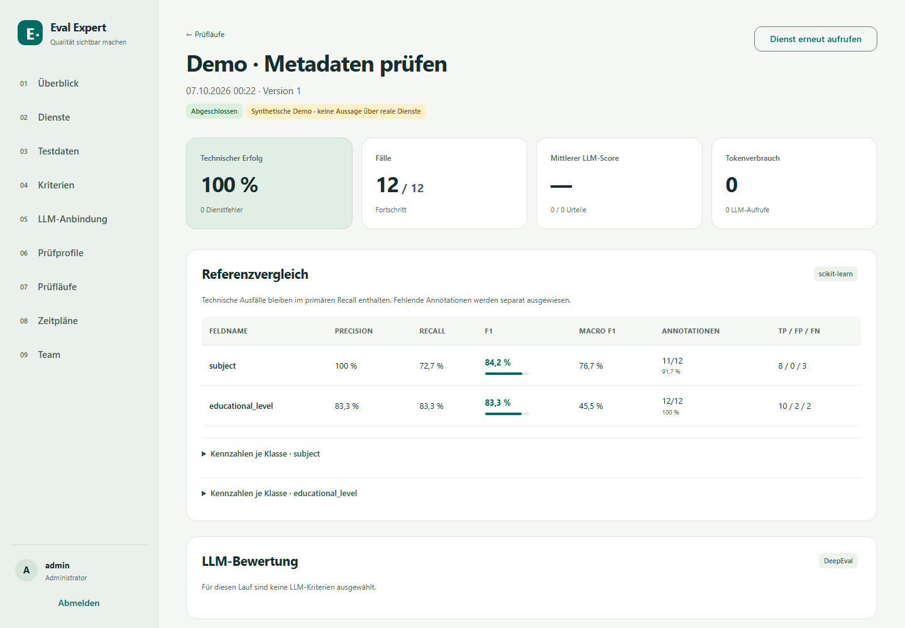

# Eval Expert

A shared internal workbench for evaluating metadata APIs. Angular 21 and Material 3 provide a
German interface; FastAPI serves the interface and evaluation API from **one Docker container**.
All fonts and assets are local. No hosted evaluation platform is required.

Two evaluation methods are deliberately separate:

- **Reference benchmarks:** scikit-learn precision, recall and F1 for single-label and multi-label
  metadata, including class support, aliases, annotation coverage and technical failures.
- **Qualitative assessment:** DeepEval GEval with editable criteria, thresholds, evidence and
  per-case reasons. Providers: direct OpenAI, b-api/OpenAI and b-api/AcademicCloud.

RAGAS, TruLens, Langfuse and additional evaluation engines are not dependencies.



## Run locally with Docker

Prerequisites: Docker Engine/Desktop with Compose and Python for the environment helper.

```sh
git clone https://github.com/janschachtschabel/eval-expert.git
cd eval-expert
git checkout preview-2026-10-07-profile-editor
python scripts/init_env.py --dev
docker compose up -d --build
```

Open **http://127.0.0.1:8080**. Sign in as `admin`, using `EVAL_ADMIN_PASSWORD` from the generated
`.env`. The helper generates both secrets; it never overwrites an existing environment file or
prints passwords. `.env`, application data and local reference skills are excluded from Git.

Select **Demo einrichten** on the overview, then **Prüfung starten**. This executes an actual local
classification benchmark on 12 clearly labeled synthetic cases. The sample classifier deliberately
makes mistakes. Demo results do not describe real services.

```sh
docker compose ps
docker compose logs --tail=100 eval-expert
docker compose stop
docker compose start
```

Do not use `docker compose down -v` when you need to retain the data.

## Hostinger / Compose-from-URL

Use a **VPS with Docker Manager**, not ordinary shared web hosting. The standalone import file uses
a pinned Git tag as its build context, so it needs no pre-uploaded source or local `.env` file:

```text
https://raw.githubusercontent.com/janschachtschabel/eval-expert/preview-2026-10-07-profile-editor/deploy/docker-compose.hostinger.yml
```

In Docker Manager, create a Compose project from that URL. Review the Compose environment and set:

| Variable | Purpose |
| --- | --- |
| `EVAL_SECRET_KEY` | Random secret, at least 32 characters; retain it for the lifetime of the database |
| `EVAL_ADMIN_PASSWORD` | Initial administrator password, at least 12 characters |
| `EVAL_ADMIN_USERNAME` | Defaults to `admin` |
| `EVAL_SECURE_COOKIE` | `true` when served through HTTPS |
| `EVAL_ALLOWED_HOSTS` | Exact comma-separated hostnames of the APIs you will evaluate |
| `EVAL_PORT` | Published port; defaults to 8080 |
| `EVAL_BIND_ADDRESS` | Defaults to loopback; use `0.0.0.0` only if your ingress setup needs it |
| `FORWARDED_ALLOW_IPS` | Exact trusted reverse-proxy IPs/CIDRs; defaults to loopback |

Generate secrets locally with `python scripts/init_env.py` and transfer the values privately to the
host environment. Do not paste them into the public repository or the Compose URL. If `.env` already
exists, keep its secret key; replace only settings you deliberately want to change.

Configure a domain and HTTPS reverse proxy that forwards `Host` and replaces forwarded headers.
Set `FORWARDED_ALLOW_IPS` to that proxy's actual address/network. Never trust `*` on a publicly
reachable application port. If the proxy runs in a separate container, loopback binding is not
reachable from it; use the host address or a deliberately shared Docker network according to your
ingress setup. The repository provides the app deployment, not a vendor-specific TLS ingress.

For a local HTTP trial only, set `EVAL_SECURE_COOKIE=false`. Otherwise a browser correctly refuses
to send the secure session cookie over HTTP.

The named volume `eval-data` persists accounts, configuration, encrypted credentials, schedules,
snapshots and results. Start with a VPS that has sufficient memory for Python scientific libraries
and the initial Node image build; **4 GB RAM is a practical starting allocation**, not a measured
capacity guarantee. No LLM model runs on this VPS. Hostinger account deployment itself has not been
performed.

[Hostinger's Compose import instructions](https://www.hostinger.com/support/12040815-how-to-deploy-your-first-container-with-hostinger-docker-manager/)
describe the supported VPS Docker Manager flow.

## Configure a real evaluation

1. Add the target hostname to `EVAL_ALLOWED_HOSTS` and restart the application. OpenAI and the
   production/staging b-api hostnames are already permitted. Only administrators manage connections.
2. In **Dienste**, create the endpoint, HTTP method and input mapping. Optionally load a public
   OpenAPI 3.x document and select an operation. Review the schema and mapping after import.
3. Import a dataset in **Testdaten**. Keep service input separate from reference annotations.
4. For qualitative assessments, add an LLM connection and criteria. Choose the model-specific
   token parameter, optional temperature and optional JSON mode deliberately.
5. In **Prüfprofile**, select service, dataset, evaluation method and reference fields or criteria.
   For advertising assessment of extracted text, choose **LLM-Bewertung**, the LLM connection
   and the advertising criterion; URL-only cases need no reference classification fields.
6. Start a run or create a cron schedule. Inspect individual responses and judge reasons before
   interpreting aggregate scores. Export CSV/JSON or open the printable protocol.

### Input mapping and response fields

Only an object containing exactly `$input` is substituted; no user code is executed. Pointers
follow JSON Pointer syntax, including `~0` and `~1` escaping.

After saving, **Antwort testen** loads that service's full configuration and derives editable
input placeholders from its `$input` pointers. Inputs and responses belong to each service
card; closing and reopening the test keeps the input for that page session. Constants from
the mapping are supplied automatically. Enter real values and check their types: pointers
alone cannot describe scalar/array types or the fields of a whole-object substitution.
An extractor using `{"url":{"$input":"/url"}}` needs test input such as
`{"url":"https://www.wirlernenonline.de"}`; it does not need a title.

Reload already open browser tabs after upgrading the application so they use the new
frontend. Service editors fetch the complete stored configuration when opened.

```json
{
  "title": {"$input": "/title"},
  "text": {"$input": "/description"},
  "options": {"language": "de"}
}
```

`{"$input":""}` sends the complete **input object**, never the separate reference object.
For GET requests, the mapped object becomes query parameters; use flat values for this method.
POST/PUT/PATCH use JSON bodies. An optional response schema can validate the result. Only local
schema references (`#...`) are permitted; external `$ref` downloads are prohibited.

A reference field can map response `/metadata/subjects` to reference `/subject`. Labels may be
strings, integers or lists. Aliases map external labels to canonical labels before deduplication.
Free description texts should use qualitative criteria rather than exact classification F1.

Credentials belong in the separate credential field, with a configurable header and prefix.
Credentials are encrypted at rest, excluded from browser responses and exports, and never sent
through a redirect. Do not put credentials into endpoint query strings or input metadata.

The OpenAPI picker currently handles JSON operations without path variables. Authentication for
fetching a private OpenAPI document, multipart bodies, streaming, asynchronous job polling and
automatic UI generation from every OpenAPI schema are outside this first version. Manual endpoint
configuration remains available.

### Dataset format

JSON uses an array. JSONL uses one case per line:

```json
{"id":"one","input":{"title":"Brüche verstehen","description":"Aufgaben zu Brüchen","source":"Geprüfter Quelltext"},"reference":{"subject":["math"],"educational_level":["primary"]}}
```

CSV can use `id,title,description,reference.subject,reference.educational_level`; multiple labels
in reference cells are separated by `|`. An empty cell is unannotated; `[]` explicitly means no
label applies. Imports are limited to 5 MB and 1,000 cases; requests to 6 MB and external responses
to 2 MB. IDs must be unique. [Example JSONL](examples/metadata.jsonl) is ready to import.

### What the metrics mean

- The primary micro scores pool TP/FP/FN across annotated cases. Failed target calls predict no
  labels, so they remain visible in recall. Technical success is reported independently.
- Missing/null gold annotations are excluded. Explicitly empty gold sets participate. Both-empty
  comparisons produce undefined scores, displayed as `—` rather than fabricated perfect scores.
- Unknown predicted labels count as false positives. Macro averages include classes with gold
  support; undefined per-class values count as zero in this macro convention.
- `successful_micro` is additionally available in JSON exports for analyses restricted to valid
  target responses. It does not replace the primary all-annotated benchmark.
- LLM averages and pass rates use valid verdicts only; valid/expected coverage and errors remain
  separate. Scores are checked for finite values in [0,1]. This adapter uses unweighted GEval
  scores because log probabilities are not requested.
- Source evidence can come from an input field or a response field. No source is explicitly
  indicated in the verdict. Enable **Quellbeleg erforderlich** for criteria that need it:
  missing or empty evidence becomes a judge error without a model request.
  Text evidence cannot certify visually advertising-free web pages.

Judge parameters, prompts, completed responses, token usage, criterion versions and reasons are
stored with each verdict. Provider rate limits/capabilities can change; model discovery is a live
action from the connection card. Live OpenAI/b-api calls require your credentials and have not
been verified against your production services or reference datasets.

## Runs, history and schedules

Each run freezes the selected configuration, dataset, credentials and engine versions. Editing a
profile changes future runs. A response can be reassessed with current criteria without invoking
the target API again, provided the dataset version is unchanged. The run links to its parent.

Comparable history requires matching dataset version, field definitions/aliases, criteria,
provider parameters and engine versions. Target service versions may differ intentionally. Choose
the reference field in the chart. A table provides the corresponding recorded data.

The queue supports at most 20 pending runs and one background worker. Cancellation takes effect
between cases and criteria; an in-flight HTTP call completes before stopping. Running work is
marked interrupted after a restart and is never automatically replayed. A new run is an explicit
decision because a target request may have side effects. Queued work remains durable.

History is paginated in groups of 50, case summaries in groups of 25. Individual case details
are loaded on demand; status polling does not send the dataset or raw responses. JSON/CSV exports
and reports include all stored cases and stream them in bounded batches. A run can store at most
50 MB of snapshot and result evidence; each reference field supports at most 10,000 labels.
Exceeding a budget fails explicitly and retains already stored evidence. Valid fields remain
evaluable when another field has an invalid type. Raw schema-invalid responses remain available
for inspection and reassessment.

API read contracts: `GET /api/runs/page?limit=50&offset=0` returns `items`, `total`, `limit`,
`offset`; optional `comparison_key` and `status` filter before pagination. `GET /api/runs/{id}`
returns configuration without dataset cases and the first 25 case summaries. Use
`GET /api/runs/{id}/status`, `/cases?limit=25&offset=0` and `/cases/{ordinal}` for progress,
case pages and complete individual evidence (zero-based ordinal). Catalog lists contain small
summaries; dataset options use `case_count`, without case bodies. Fetch
`/api/catalog/{kind}/{id}` before editing. The legacy `/api/runs` list is limited
to 200 summaries; use `/page` for the complete history. Run reads include aggregate reference
metrics and class counts. Per-label scores use `/api/runs/{id}/classes?field=subject&limit=50&offset=0`;
the complete class tables remain in JSON exports.

Schedules use five-field cron expressions and IANA time zones, defaulting to `Europe/Berlin`.
`0 8 * * 1` means Monday at 08:00 local time. The worker checks schedules roughly every 30 seconds
between runs; long evaluations can delay a due schedule. Missed intervals produce one catch-up
run, not a burst. Unique schedule keys prevent duplicate enqueueing after recovery.
When the queue is full, the due time is retained for retry and a visible schedule error records
the reason. Invalid dependencies also remain visible rather than silently dropping a due run.

The worker supervisor retries after 1, 2 and 4 seconds. Health returns 503 during recovery.
Persistent worker failure exits the process with code 1 so Docker's restart policy can act.
Recovery marks uncertain running requests interrupted instead of automatically repeating them.

## Accounts and operations

Administrators create local accounts and manage API/LLM credentials. Editors manage datasets,
criteria, profiles, schedules and runs. Reviewers and viewers currently have read access. This is
one shared team installation, not organizational multitenancy. Disabling an account revokes its
sessions. Cookies are HttpOnly/SameSite and mutations require CSRF tokens.

Catalog updates require the version read by the editor (`version` on PUT). Stale saves return
409 and preserve the current record; the UI offers explicit reload. Deleting resources referenced
by profiles or schedules returns 409. Historical run snapshots do not block deletion.

On upgrade, the SQLite schema moves automatically to version 3, backfilling small read models
without discarding original snapshots, results, accounts or catalog versions. A one-time
credential migration encrypts configured authentication headers in legacy connection bodies,
scrubs public history and vacuums freed database pages. Keep `EVAL_SECRET_KEY` unchanged.
Back up the complete stopped volume and secret key before upgrading; rollback restores that
backup together with the previous immutable image/tag. Do not run the older app against an
upgraded database.

The audit correction report is in [docs/audits/2026-10-07-remediation.md](docs/audits/2026-10-07-remediation.md).
The October 6 preview remains immutable; the October 7 preview includes these corrections.

`EVAL_ADMIN_PASSWORD` is used only to initialize an empty database. Changing it later does not
change an existing account. An operator with access to the container can reset a password without
putting it in shell history:

```sh
docker compose exec eval-expert python -m app.manage reset-password admin
```

All sessions for that account are revoked. Keep the secret key securely backed up; changing it
without migrating stored credentials makes those credentials unreadable.

For a consistent backup, stop the app and back up the whole named volume plus the secret key in a
separate secure location. Do not copy a live SQLite database while excluding its WAL. Restore
ownership for UID/GID 10001. The container is non-root, its image filesystem is read-only, and its
health check covers the database and background task. Monitor disk space and retained results.

## Development and verification

Python 3.12, Node 22.12+ and uv are used. Dependencies are locked in `backend/uv.lock` and
`frontend/package-lock.json`.

```sh
uv sync --project backend --python 3.12
cd backend
uv run pytest -q
uv run ruff check app tests
cd ../frontend
npm ci
npm run test:unit
npm run build
npx playwright install chromium
cd ..
```

From the repository root, initialize `.env --dev` as above, then run:

```sh
uv run --project backend uvicorn app.main:create_app --factory --app-dir backend --host 127.0.0.1 --port 8117
```

Serve the compiled frontend, or use `npm start` in `frontend` for Angular development (its proxy
expects backend port 8000; use that port if available). Browser tests expect 8117 by default and
the isolated test password `Test-password-for-browser!`; override `EVAL_TEST_URL` and
`EVAL_TEST_PASSWORD` for your test installation. Do not use test credentials in production.

GitHub CI runs backend tests/lint, the Angular build, browser flows and a Docker build. See
[verification evidence](docs/verification.md), [implementation plan](docs/plans/2026-10-06-implementation.md)
and [review findings](docs/review.md).

SQLite WAL and an advisory worker lock deliberately support **one app instance / one process**.
Do not scale replicas or share the volume across hosts. A PostgreSQL/worker migration is a later
scaling step. Browser-based crawling, visual ad detection, RAG/chatbot evaluation, SSO, a server PDF
renderer and automatic calibration workflows are deferred.
