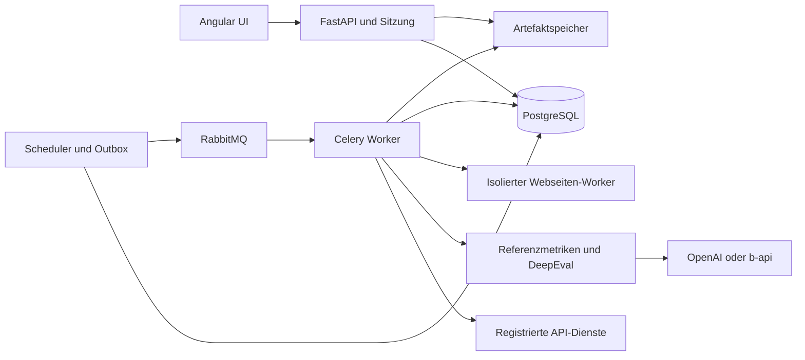

# Eval Expert Architektur und Funktionsplan

> Historischer Architekturvorschlag. Der freigegebene Umsetzungsstart wurde für eine gemeinsame
> Installation auf einen App-Container mit SQLite und einem Worker vereinfacht. Der aktuelle
> Lieferumfang, die bewussten Grenzen und die Abnahme stehen im
> [verfeinerten Umsetzungsplan](2026-10-06-implementation.md) und in der [README](../../README.md).
> PostgreSQL, Celery, RabbitMQ und zusätzliche Skalierungsfunktionen dieses Vorschlags werden
> in der ersten Version nicht eingesetzt.

Entwurf zur Abnahme vom 6. Oktober 2026. Die Umsetzung beginnt nach der Freigabe dieses Plans.

Eval Expert soll Metadaten-Dienste aus Crawlern und Generierungsdiensten anhand versionierter Testfälle automatisch prüfen. Empfohlen wird eine intern betriebene Angular-Anwendung mit FastAPI, lokalen Benutzerkonten, dauerhafter Datenhaltung und separaten Hintergrundprozessen. Zwei Arbeitsbereiche teilen sich dieselben Dienstanbindungen und Messläufe: Referenzvergleich gegen bereits klassifizierte Daten mit Präzision, Recall und F1 sowie qualitative LLM-Bewertung mit DeepEval. DeepEval ist das einzige geplante LLM-Evaluationsframework; die Referenzmetriken berechnet scikit-learn als eingebundene Python-Bibliothek. Die App verwaltet Anbindungen, Prüfverfahren, Messungen, Zeitpläne, Vergleiche und Berichte gemeinsam.

## Ziel und Rahmenbedingungen

Ein Team soll einen neuen HTTP-Dienst ohne Programmierung registrieren, seine Eingaben und Ausgaben zuordnen, eigene Prüfkriterien erstellen und Messungen sofort oder regelmäßig durchführen können. Ergebnisse müssen auf konkrete Testfälle, Einstellungen und Belege zurückführbar sein.

Bestätigte Anforderungen:

- Unterschiedliche API-Dienste und Ein- und Ausgabeschemata; häufig FastAPI mit OpenAPI.
- Interne gemeinsame Installation für ein Team und lokale Benutzerkonten in der App.
- Metadaten aus Crawlern und Generierungsdiensten: insbesondere Titel, Beschreibung, Keywords, Fach und Bildungsstufe.
- Bereits klassifizierte Datensätze als Referenz; passende Felder mit Präzision, Recall und F1 messen.
- LLM-Bewertung von Metadaten, Beschreibungen, Bildungseignung und Werbung auf Webseiten.
- Komfortable Oberfläche, eigene Kriterien, zeitgesteuerte Messungen, Verläufe und Prüfprotokolle.
- OpenAI und die edu-sharing b-api als LLM-Zugänge.
- Material Design 3 als gestalterische Orientierung; ausschließlich lokale Schriftarten und Oberflächenassets.
- Geschützter Zugang sowie Exporte von Ergebnissen und Berichten.
- Zunächst Planung und Abnahme, anschließend Umsetzung.

Vorläufige Annahmen zur Freigabe:

| Punkt | Vorgeschlagener Ausgangspunkt | Folge einer anderen Entscheidung |
| --- | --- | --- |
| Projektstruktur | Gemeinsame Installation mit optionalen Projektbereichen | Ein einziges Projekt kann im Pilot die Auswahl vereinfachen |
| Pilotdaten | Ein vorhandener klassifizierter Datensatz und zwei Metadaten-API-Schemata | Die konkrete Feldzuordnung hängt von diesen Beispielen ab |
| Frontend | Angular 21 und Angular Material 21 als eigenständige App | Direkte Einbettung in ein edu-sharing-Frontend hängt von dessen tatsächlichen Versionen ab |
| Deployment | Docker Compose auf einem internen Linux-Host | Vorhandenes Kubernetes oder andere Betriebsstandards ändern die Auslieferung |
| Sprache | Deutsch zuerst, vorbereitet für Englisch | Weitere Sprachen benötigen eigene Kriterienkalibrierung |
| Daten | Möglichst öffentliche Bildungsinhalte, projektbezogene Speicher- und Providerregeln | Vertrauliche Inhalte erfordern entsprechend eingeschränkte Speicher- und LLM-Profile |

Der Projektordner enthält noch keine Anwendung und keine Projektvorgaben. Die Struktur kann deshalb von Beginn an auf diese Anforderungen ausgerichtet werden.

RAG gehört nicht zum ersten Ausbau. Der Chatbot hat bereits eine eigene Evaluation; eine spätere Anbindung kann bei Bedarf zusätzlich geprüft werden.

## Vergleich der Ansätze

| Ansatz | Nutzen | Grenzen | Aufwand und Risiko |
| --- | --- | --- | --- |
| A Eigene fachliche App mit scikit-learn und DeepEval | UI und Abläufe passen zu edu-sharing; Referenzvergleich und LLM-Bewertung teilen dieselben Dienstaufrufe | Dienste-, Nutzer-, Projekt-, Zeitplan- und Berichtsverwaltung werden selbst entwickelt | Mittlerer bis höherer Anfangsaufwand; kontrollierbare Erweiterung durch getrennte Adapter |
| B Langfuse als zentrale Plattform mit eigenem Runner | Vorhandene Datasets, Evaluationen, Annotationen und Verlaufsansichten | Generische API-Anbindung und Bildungsworkflow brauchen zusätzliche Arbeit; Oberfläche folgt Langfuse statt Angular/Material | Weniger eigene Verwaltungsoberfläche, dafür Anpassungs- und zusätzlicher Betriebsaufwand |
| C Promptfoo als Ausgangspunkt | HTTP-Anbindungen und konfigurationsorientierte Evaluationen beschleunigen einen technischen Pilot | Komfortable fachliche Kriterienverwaltung, Zeitpläne und Protokolle müssen auf Passung geprüft oder ergänzt werden | Niedrigster Aufwand für Entwickler-Pilot; höheres Risiko bei späterem Ausbau zur gewünschten Fachanwendung |

Empfehlung: Ansatz A. Bereits vorhandene Bausteine nachnutzen, die fachliche App aber selbst bauen. B ist attraktiv, wenn die vorhandene Oberfläche akzeptiert wird und Beobachtung bestehender LLM-Anwendungen wichtiger wird. C ist attraktiv, wenn zunächst Entwickler mit Konfigurationsdateien arbeiten sollen.

Diese Aufwandsvergleiche sind Architekturabschätzungen, keine gemessenen Projektlaufzeiten.

## Verwendete Evaluationsbausteine

| Baustein | Dokumentierte Fähigkeiten | Vorgeschlagener Einsatz |
| --- | --- | --- |
| scikit-learn | Klassifikationsmetriken, verschiedene Mittelungen und klassenbezogene Auswertung | Engine des ersten Arbeitsbereichs; ohne LLM-Kosten |
| DeepEval | G-Eval für eigene Kriterien, Bewertungsschritte und Rubriken; anpassbare LLM-Anbindung | Erste Engine für domänenspezifische Qualitätsbewertungen |

Für die beschriebenen Anwendungsfälle reichen diese beiden Bausteine. Referenzmetriken, eigene LLM-Rubriken und deterministische Regeln benötigen weder zusätzliche Evaluationsplattformen noch eine Pluginverwaltung. Beide Bibliotheken laufen innerhalb desselben Backend-/Worker-Codebestands und erhalten keine eigenen Server, Benutzerverwaltungen oder Datenbanken.

Die Empfehlung für DeepEval ist eine Einschätzung zur fachlichen Passung. G-Eval unterstützt eigene Kriterien und Rubriken; die Bibliothek ist Apache-2.0-lizenziert. [DeepEval G-Eval](https://deepeval.com/docs/metrics-llm-evals), [DeepEval Repository](https://github.com/confident-ai/deepeval).

RAGAS, TruLens, Promptfoo und Langfuse wurden als Alternativen betrachtet und sind keine vorgesehenen Abhängigkeiten. Ihre Integration gehört auch nicht zum Aufgabenplan. RAGAS und TruLens werden nur bei einem späteren neuen Auftrag zu RAG oder instrumentierten Anwendungen erneut bewertet. Promptfoo oder Langfuse wären alternative Ausgangspunkte statt zusätzliche Plattformen dieses Entwurfs. [RAGAS Metriken](https://docs.ragas.io/en/stable/concepts/metrics/available_metrics/), [TruLens Feedback-Funktionen](https://www.trulens.org/component_guides/evaluation/), [Promptfoo HTTP-Provider](https://www.promptfoo.dev/docs/providers/http/), [Langfuse Evaluation](https://langfuse.com/docs/evaluation/overview).

Die App übernimmt Ergebnisse explizit in ihre eigene Datenhaltung. DeepEval-Cloudfunktionen werden für diesen Aufbau nicht benötigt. Die Bibliothekstelemetrie wird mit `DEEPEVAL_TELEMETRY_OPT_OUT=1` deaktiviert und ausgehender Verkehr auf erlaubte Dienste begrenzt. [DeepEval Datenschutz](https://deepeval.com/docs/data-privacy). Klassifikationsmetriken werden mit scikit-learn berechnet. [scikit-learn Klassifikationsmetriken](https://scikit-learn.org/stable/modules/generated/sklearn.metrics.precision_recall_fscore_support.html).

## Architektur

Ein modularer Monolith hält den Anfang überschaubar: API, Worker und Scheduler nutzen denselben Python-Code und dieselben Fachmodelle, laufen aber in getrennten Prozessen. Längere Messungen überleben damit Browserwechsel und API-Neustarts.



| Komponente | Verantwortung | Nachnutzung |
| --- | --- | --- |
| Angular-Frontend | Dienstassistent, Kriterieneditor, Testdaten, Ausführung, Vergleich und Berichte | Angular Material, lokale SVG-Icons, Apache ECharts |
| FastAPI | Eigene OpenAPI, Projektberechtigungen, Konfigurationen, Start/Abbruch und Ergebniszugriff | Pydantic, SQLAlchemy, Alembic, HTTPX |
| Celery-Worker | Dauerhafte Aufträge, Dienstaufrufe, Normalisierung, Referenzmetriken, LLM-Metriken und Exporte | Celery mit RabbitMQ als dokumentiert unterstütztem Broker |
| Scheduler | Fällige Zeitpläne ermitteln und neue Runs eindeutig anlegen | Celery-Zeitberechnung, PostgreSQL-Sperren und dauerhafte Outbox |
| PostgreSQL | Versionen, Projekte, Run-Zustände, Bewertungen, Audit und Aggregationen | PostgreSQL und JSONB für variable Nutzdaten |
| Artefaktspeicher | Quellen, Antworten, Screenshots und exportierte Berichte | Geschütztes lokales Volume im Pilot; S3-kompatibler Speicher später |
| Browser-Worker | Webseiten rendern und Belege erfassen; separat begrenzte Ressourcen und Netzwerkrechte | Playwright; HTML-Textextraktion über einen austauschbaren Extraktor |
| Lokale Nutzerverwaltung | Anmeldung, Nutzeranlage, Passwortwechsel, administrative Rücksetzung und serverseitige Sitzungen | Argon2id über argon2-cffi; Sessionzustand in PostgreSQL |

RabbitMQ ist ein stabil unterstützter Celery-Broker. Ergebnisse werden in PostgreSQL und im Artefaktspeicher gehalten. [Celery Broker](https://docs.celeryq.dev/en/stable/getting-started/backends-and-brokers/).

Abhängigkeiten zeigen von der Infrastruktur zur Fachlogik: Ein einfaches Evaluationsmodul setzt interne Evaluationstypen in DeepEval-Aufrufe um. Web-Controller und UI enthalten keine Bewertungslogik. Eine Engine-Registry oder Unterstützung weiterer Frameworks wird nicht gebaut; die Modulgrenze genügt, um die konkrete Bibliotheksanbindung übersichtlich zu halten.

Für den Pilot sind weder Vektordatenbank noch Kafka noch ein Verbund vieler Microservices erforderlich. Kubernetes wird erst durch die Betriebsumgebung oder den Skalierungsbedarf begründet.

## Generische Dienstanbindung

Ein Dienst wird als versionierte Connector-Konfiguration registriert. Ziel-Dienste und Bewertungs-LLMs sind unterschiedliche Objekte; ihre Parameter werden getrennt gespeichert.

Der Assistent führt durch folgende Schritte:

1. OpenAPI als JSON/YAML hochladen oder von einer registrierten URL laden; alternativ HTTP-Dienst manuell beschreiben.
2. Basis-URL, Umgebung und eine konkrete Operation auswählen. Importierte Operationen werden niemals automatisch ausgeführt.
3. Authentifizierung als Secret-Referenz auswählen: API-Key/Header, Bearer oder Basic im ersten Ausbau; OAuth2-Servicezugang als Erweiterung.
4. Testfallfelder in Body, Pfad und Query abbilden. Strukturierte JSON-Vorlagen setzen Werte typgerecht ein, ohne unkontrollierte Textsubstitution.
5. Ausgabefelder im Beispiel auswählen. JSON Pointer unterstützt verschachtelte Objekte und feste Arraypositionen; Projektionen über Listen sind definierte deklarative Transformationen.
6. Request-, Response- und Bewertungsansicht prüfen, danach einen kleinen Probelauf starten.

Beispiel: `testcase.source_url` wird auf Request-Feld `/url` abgebildet; Response-Feld `/metadata/description` wird zur zu prüfenden Beschreibung; `/metadata/educationalContext` wird zur Bildungsstufe. Ein anderer Dienst kann `/result/summary` verwenden. Diese Unterschiede benötigen eine neue Konfiguration, keine eigene Oberfläche.

OpenAPI beschreibt Syntax und Operationen, erklärt aber nicht die pädagogische Bedeutung der Felder. Diese Zuordnung und die Auswahl der Kriterien bleiben explizite Konfiguration. OpenAPI 3.0 und 3.1 werden getrennt interpretiert; insbesondere Schema-Dialekte, `nullable`, Referenzen und Varianten müssen korrekt behandelt werden. Die erste Version unterstützt synchrone HTTP-Operationen mit JSON-Ein- und Ausgabe sowie einfachem Textoutput. Nicht unterstützte Multipart-, Streaming-, Callback- oder komplexe Serialisierungen werden erkennbar abgewiesen. [OpenAPI 3.1 Schema](https://spec.openapis.org/oas/v3.1.1.html).

Schemaänderungen erzeugen eine neue Connector-Version mit Diff. Ein bestehender Prüfplan behält seine Version, bis die Änderung übernommen wird. `$ref`-Downloads und Server-URLs unterliegen denselben Netzwerkregeln wie Dienstaufrufe.

In der UI wird kein frei ausführbarer Python- oder JavaScript-Code zugelassen. Spätere Spezialadapter sind geprüfte, installierte Servermodule.

## Testfälle und Bewertungsdaten

Ein Dataset enthält versionierte Testfälle, Referenzmetadaten mit Feldstatus, Quellen, Zielgruppe, Fach, Bildungsstufe, Sprache und Tags. Unterstützt werden manuelle Erfassung sowie CSV-, JSON- und JSONL-Import. Ein Vorschau- und Fehlerbericht zeigt fehlerhafte Zeilen vor der Übernahme. Der Importassistent ordnet bestehende Spalten getrennt Eingabefeldern und Referenzlabels zu; fehlende Annotation ist etwas anderes als eine bestätigte leere Labelmenge.

Der interne `EvaluationSample` enthält:

- `input`: fachliche Eingabe und tatsächlich versendeter Request ohne Secrets.
- `actual_output`: normalisierte Ausgabe des geprüften Dienstes.
- `reference_output`: fachliche Referenz mit Annotationstatus je Feld.
- `source_artifacts`: gespeicherte Texte, HTML, Screenshots und Erfassungsmetadaten.
- `context`: Zielgruppe, Fach, Sprache und sonstige Kriterienparameter.
- `mapping_version`: die konkrete Zuordnung der Dienstfelder.

Jedes Kriterium wählt daraus nur die tatsächlich notwendigen Felder. Beispielsweise braucht Quellenbezug sowohl Originaltext als auch Beschreibung. Fehlt die Quelle, ist das Ergebnis nicht beurteilbar.

Ein dauerhaftes Benchmark-Dataset dient dem vergleichbaren Verlauf. Neue oder rotierende Praxisfälle werden als eigener Messmodus geführt. Herkunft und Nutzungserlaubnis der Testdaten werden dokumentiert.

## Arbeitsbereich Referenzvergleich

Ein typischer Prüfplan sendet vorhandenen Titel, Beschreibung und Keywords an einen Klassifikationsdienst. Die Antwort mit Fach und Bildungsstufe wird mit den bereits vergebenen Referenzklassen verglichen. Ein anderer Prüfplan kann neu generierte Keywords messen. Welche Felder Eingabe und welche Messziel sind, wird explizit festgelegt. Referenzlabels gelangen nicht automatisch in den Request. Eine direkte Übernahme eines zu bewertenden Referenzfeldes in die Eingabe wird als möglicher Datenleckagefall markiert.

Der Prüfplan enthält je Metadatenfeld eine `FieldScoringSpecVersion`: Ausgabepfad, Referenzpfad, Single-/Multi-Label-Modus, Vokabularversion, Normalisierung, Klassenraum, Umgang mit fehlenden Annotationen und Aggregationsregel. Fach und Bildungsstufe sind häufig Multi-Label-Aufgaben; die Kardinalität wird aus dem jeweiligen Datenmodell bestimmt.

Vor dem Vergleich werden URIs, IDs und ausdrücklich gepflegte Label-Aliasse auf kanonische Werte abgebildet und Duplikate entfernt. Ein LLM nimmt diese Zuordnung nicht stillschweigend vor. Unbekannte ausgegebene Labels bleiben sichtbar und zählen bei vollständiger Referenz als falsche zusätzliche Vorhersagen. Ein fehlerhaftes oder unvollständiges Gold-Label führt zu einem Importfehler beziehungsweise einer eingeschränkten Auswertung.

Für eine vorhergesagte Menge P und eine Referenzmenge G gelten TP = Schnittmenge, FP = P ohne G und FN = G ohne P. Daraus folgen Präzision = TP/(TP+FP), Recall = TP/(TP+FN) und F1 = 2TP/(2TP+FP+FN). Beispiel: Referenz {Mathematik, Physik}, Vorhersage {Mathematik, Chemie} ergibt je einen TP, FP und FN und damit Präzision = Recall = F1 = 0,5.

Die UI zeigt je Feld Micro-F1 über alle Labelentscheidungen, Macro-F1 über die versioniert festgelegten auswertbaren Klassen, Präzision, Recall, Fallzahl und Support je Klasse. Eine zusätzliche nach Support gewichtete Mittelung ist verfügbar. Bei Single-Label-Feldern kommen Accuracy und eine Verwechslungsmatrix hinzu; bei Multi-Label-Feldern klassenbezogene Fehlertabellen und optional exakte Mengenübereinstimmung. Die Mittelungen folgen den dokumentierten scikit-learn-Definitionen. [scikit-learn Mittelungen](https://scikit-learn.org/stable/modules/generated/sklearn.metrics.precision_recall_fscore_support.html).

Der Klassenraum und die Nullfallregel werden eingefroren: Nicht definierte Brüche erscheinen als nicht definiert, nicht als perfekter Wert. Primäres Macro-F1 verwendet Klassen mit Referenzsupport im festgelegten Datensatz; nicht unterstützte vorhergesagte Klassen erscheinen zusätzlich und fließen in die Micro-FP ein. Alle Klassen und ihre Supportzahlen werden exportiert. Eine fachlich bestätigte leere Menge bleibt ein gültiger Testfall, erhält aber nicht automatisch ein künstliches F1 von eins.

Es gibt zwei getrennte Auswertungen: Qualität auf erfolgreich beantworteten Fällen und Leistung über alle annotierten angefragten Fälle. Bei der zweiten Variante wird ein fehlgeschlagener Zielaufruf als fehlende Vorhersage geführt, wodurch vorhandene Goldlabels zu FN werden. Die technische Erfolgsquote wird immer daneben ausgewiesen. Fehlerfälle behalten ihren Fehlerstatus; diese explizite Aggregationspolicy erfindet keinen individuellen Qualitätsbefund. So kann ein instabiler Dienst nicht allein durch das Auslassen seiner schwierigen Fälle besser aussehen.

Fehlende Goldannotation reduziert die Referenzabdeckung und wird nicht als negative Klasse interpretiert. Bei unvollständig annotierten Keywords werden Precision/F1 entweder ausgesetzt oder als Auswertung gegen eine partielle Referenz gekennzeichnet, weil zusätzliche richtige Begriffe sonst als Fehler erscheinen können. Hierarchische Klassen werden zunächst exakt verglichen; ein optionaler hierarchischer Vergleich erhält eine eigene Metrikversion und wird nicht mit exaktem F1 vermischt.

Titel und Beschreibung sind freie Texte. Präzision/Recall/F1 über Klassen bewerten ihre inhaltliche Qualität nicht sinnvoll. Sie werden über die LLM-Kriterien des zweiten Arbeitsbereichs geprüft; exakte Textübereinstimmung oder später Textähnlichkeit können als zusätzliche technische Kennzahlen dienen.

Datensätze besitzen ein dauerhaftes Splitmanifest für Entwicklung und zurückgehaltene Abnahmefälle. Wenn ein Dienst anhand dieser Daten verbessert wird, bleibt die Abnahmemenge getrennt. Gruppierung nach Material, Dubletten oder Quelle verhindert, dass nahezu identische Fälle in beiden Mengen landen. Vergleiche verwenden dieselben Fälle; optionale Konfidenzintervalle werden auf Fallebene statt auf wiederholten Calls berechnet.

Ein kombinierter Plan ruft die Ziel-API einmal auf, speichert die Antwort und wertet sie anschließend mit Referenzmetriken und LLM-Kriterien aus. Die zwei Arbeitsbereiche verwenden separate Ansichten und Berichte; ihre Zahlen werden nicht zu einem undurchsichtigen Gesamtscore zusammengefasst.

## Arbeitsbereich LLM Bewertung

Ein Kriterium hat einen stabilen Namen sowie unveränderliche Versionen mit Typ, Definition, erforderlichen Daten, Rubrik, Beispielen, Schwelle, Gewicht, Kritikalität und Bewertungsmodell. Ein freies Feld für einen Prompt wird durch diese strukturierten Angaben ergänzt.

| Typ | Beispiel | Umsetzung |
| --- | --- | --- |
| Deterministische Regel | Pflichtfelder, valides Schema, Textlänge, gültige Vokabularwerte | JSON Schema und geprüfte Regeloperatoren |
| Referenzvergleich | Präzision/Recall von Fach-Tags gegen annotierte Referenzen | Exakte Mengenvergleiche; semantische Verfahren erst bei Bedarf |
| LLM mit Rubrik | Verständlichkeit, Neutralität, Zielgruppenpassung, Quellenbezug | DeepEval G-Eval mit festen versionierten Bewertungsschritten |
| Klassifikation | Werbung erkannt, externe Werbung, Eigenwerbung, unklar | Strukturierte LLM-Bewertung plus technische und visuelle Belege |
| Technische Messung | Statuscode, Schemaabweichung, Fehlerquote und Latenz | Tatsächliche HTTP-Messwerte |

Vorgeschlagenes Starterpaket:

| Kriterium | Bewertungsfrage | Benötigte Daten |
| --- | --- | --- |
| Quellenbezug | Sind Aussagen in der Beschreibung durch die Quelle gedeckt? | Quelle und Beschreibung |
| Beschreibungsgüte | Erklärt die Beschreibung Gegenstand, Format und möglichen Einsatz? | Beschreibung und Materialkontext |
| Verständlichkeit | Ist die Formulierung klar und für die Zielgruppe passend? | Beschreibung, Zielgruppe und Sprache |
| Neutralität | Enthält sie unbelegte Wertungen oder werbliche Versprechen? | Beschreibung |
| Bildungsbezug | Passt das Material zu angegebenem Fach, Lernziel und Bildungsstufe? | Quelle und entsprechende Metadaten |
| Metadatenqualität | Sind Felder vollständig, konsistent und erlaubte Werte verwendet? | Schema, Vokabular und Metadaten |
| Werbebelastung | Welche kommerziellen Elemente wurden in der erfassten Seite sichtbar? | HTML/DOM, Frames, Screenshot und Erfassungsszenario |

Bildungseignung wird entlang dieser Dimensionen bewertet. Ein universelles Ja/Nein ohne Zielgruppe und Nutzungskontext wäre fachlich zu grob. Fehlende Lizenzangaben sind ein eigenes Datenproblem und kein Beweis für oder gegen eine freie Nutzung.

Bewertungen speichern `status`, `raw_score`, `score`, `passed`, `reason`, `evidence_refs`, `flags`, Modell- und Metrikversion. `score` liegt bei auswertbaren Bewertungen in `[0,1]`; höhere Werte bedeuten durchgehend bessere Qualität. Die ursprüngliche Skala und eine eventuell nötige Umkehrung bleiben dokumentiert. Bei Fehlern oder fehlenden Belegen sind `score` und `passed` leer.

Mögliche Status: `scored`, `not_applicable`, `insufficient_evidence`, `target_error`, `schema_error`, `judge_error`. Ein technischer Fehler wird niemals zu einem Qualitätswert von null umgedeutet. Der Run-Zustand und das fachliche Bestehen werden ebenfalls getrennt ausgewiesen.

Gesamturteil für die LLM-Kriterien: Ein kritisches Kriterium unter seiner Schwelle führt zu `failed`; ein nicht beurteilbares kritisches Kriterium zu `review_required`. Ein gewichteter Mittelwert kann ergänzend angezeigt werden, verdeckt aber keine kritischen Einzelbefunde. Anzahl erfolgreicher Bewertungen, fehlende Bewertungen und Abdeckung stehen immer daneben. Vorgeschlagene Mindestabdeckung: 95 Prozent der anwendbaren Bewertungen und vollständige Beurteilung der kritischen Kriterien; projektspezifisch freizugeben. Referenzmetriken haben eigene feldbezogene Schwellen und werden getrennt dargestellt.

## Besonderheiten der Webseitenprüfung

Bereinigter Haupttext hilft bei Beschreibungen. Werbung kann jedoch in Bannern, Frames, Pop-ups oder nach JavaScript-Ausführung erscheinen. Daher werden Haupttext und Werbebelege separat erfasst.

Ein Browser-Erfassungsprofil definiert Viewport, Sprache, Region soweit steuerbar, Wartezeit, Cookiezustand und Scrolltiefe. Die erste Version verwendet eine frische Sitzung ohne automatische Zustimmung; blockierte Inhalte werden dokumentiert. Weitere Szenarien können später ergänzt werden.

Gespeichert werden URL und Weiterleitungen, Zeitpunkt, HTML/DOM, Haupttext, sichtbare Frames soweit erfassbar, Screenshot, relevante Ladefehler und Profilversion. Screenshots werden über ein dafür qualifiziertes multimodales Judge-Profil bewertet. Bei einem Textmodell wird die visuelle Bewertung ausgelassen und die eingeschränkte Beleglage ausgewiesen.

Ergebnisse unterscheiden `advertising_detected`, `no_advertising_observed` und `insufficient_evidence`. Letzteres gilt etwa für Login-Sperren, ungeladene relevante Frames oder Erfassungsfehler. Keine beobachtete Werbung belegt nur das erfasste Szenario und keine dauerhafte Werbefreiheit. Werbung, Affiliate-Links, Eigenwerbung, Spendenhinweise und Consent-Dialoge erhalten getrennte Kategorien.

Die Browserausführung läuft isoliert, mit Zeit-, Größen- und Ressourcenlimits. Erfasstes fremdes HTML wird nicht aktiv innerhalb der App gerendert. Belege werden als escaped Text, Screenshot oder separater Download angezeigt.

Wenn der geprüfte Dienst selbst eine URL live lädt, kann seine Quelle von unserer Erfassung abweichen. Dieser Umstand wird vermerkt. Vergleichbarkeit ist am stärksten, wenn der Dienst einen eingefrorenen Quelltext als Eingabe akzeptiert.

## Anbindung von OpenAI und b-api

Ein Provider-Profil enthält Basis-URL, Provider, Secret-Referenz, Modell-ID, unterstützte Features, Modellparameter, Timeouts, globale Parallelität und Budgetregeln. Die verwendete Konfiguration wird bei Run-Start eingefroren.

Das lokale b-api-Wissen steht im kopierten Skill [wlo-b-api-llm](../../.agents/skills/wlo-b-api-llm/SKILL.md). Die 14 WLO-/edu-sharing-Skillordner samt Begleitdateien stammen aus `C:/Users/jan/.claude/skills` und liegen unverändert unter `.agents/skills` im Projekt. Die enthaltenen Last- und Modellmessungen sind zeitgebundene Beobachtungen.

Aus diesem b-api-Wissen ergeben sich folgende Anschlusskonfigurationen:

| Zugang | Pfad | Authentifizierung |
| --- | --- | --- |
| OpenAI direkt | Konfigurierbarer OpenAI-Zugang | Bearer-Zugang im serverseitigen Adapter |
| b-api OpenAI | `/api/v1/llm/openai/chat/completions` | `X-API-KEY` |
| b-api AcademicCloud | `/api/v1/llm/academiccloud/chat/completions` | `X-API-KEY` |

b-api-Basis-URLs werden für Staging und Produktion getrennt konfiguriert. Modelllisten kommen aus den jeweiligen `/models`-Endpunkten, soweit erreichbar. Historische Modellnamen und Lastgrenzen aus dem Skill werden nicht als aktuelle Verfügbarkeit übernommen. Optionale Felder wie `status` und `demand` sind Diagnoseinformationen.

Vor Nutzung eines Judge-Profils wird mit einem kleinen Capability-Test geprüft: gültiger Text, strukturierte JSON-Ausgabe, Schema-Verhalten, nötige Tokenparameter, optionale Temperatur, Bildinput und optionale Logprobs. Capability-Profile sind pro Zugang und Modell versioniert. Reasoning-Optionen werden nur gesendet, wenn das Modell sie tatsächlich unterstützt.

Der DeepEval-Adapter muss Schema-bewusste synchrone und asynchrone Methoden anbieten. Ungültiges JSON oder abgebrochene Antworten werden als Bewertungsfehler erfasst; eine begrenzte Wiederholung ist transparent. Reines `reasoning` bei leerem `content` ersetzt kein fertiges Bewertungsergebnis. Es werden knappe Befundbegründungen und Belege gespeichert, keine internen Reasoning-Streams. [DeepEval Custom LLM](https://deepeval.com/guides/guides-using-custom-llms).

G-Eval verwendet bei geeigneten Custom-Adapter-Antworten Logprobs zur gewichteten Bewertung; ohne diese fällt es auf den erzeugten Rohscore zurück. Der Bewertungsmodus wird deshalb gespeichert und beeinflusst die Vergleichbarkeit. [DeepEval G-Eval](https://deepeval.com/docs/metrics-llm-evals).

Kein stiller Wechsel des Judge-Modells bei Überlastung. Warteschlange, Retry oder ausdrücklich eingerichtetes alternatives Experiment sind zulässig; ein Modellwechsel erzeugt eine andere Messreihe. Provider-Limits gelten über alle Worker und Projekte hinweg, soweit derselbe Zugang genutzt wird. Für den Pilot genügen PostgreSQL-basierte begrenzte Slots mit Lease/Heartbeat und eine gespeicherte Mindestabstandsregel. Externe Verbraucher desselben Schlüssels können weiterhin das upstream verfügbare Kontingent verändern.

Vorgeschlagener konservativer Start: zwei gleichzeitige Calls je Provider-Zugang, ein Call pro Sekunde und 180 Sekunden konfigurierbares LLM-Timeout. Diese Werte sind Startkonfigurationen, keine Behauptung über heutige b-api-Grenzen. `429` und temporäre `5xx` erhalten Backoff mit Zufallsanteil und Beachtung von `Retry-After`, wenn vorhanden. Wiederholungen erhöhen die dokumentierte Callzahl und gegebenenfalls die Kosten.

## Messungen Zeitpläne und Verläufe

Ein Prüfplan verbindet Connector-Version, Dataset-Version, feldbezogene Referenzauswertung, Kriterienversionen, gegebenenfalls Judge-Profile, Wiederholungsanzahl und Budget. Sein `evaluation_kind` ist `reference`, `judge` oder `combined`. Reine Referenzmessungen benötigen keine LLM-Zugangsdaten. Drei Ausführungsmodi sind vorgesehen:

- `live`: Den Ziel-Dienst aufrufen und dessen neue Antwort bewerten.
- `rejudge`: Gespeicherte Antworten und Quellen mit einem geänderten Prüfverfahren neu bewerten.
- `compare`: Zwei Dienstkonfigurationen auf denselben versionierten Fällen vergleichen; Reihenfolge randomisieren, soweit sinnvoll.

Target- und Judge-Wiederholungen werden getrennt konfiguriert. Dadurch lässt sich unterscheiden, ob die API oder das bewertende LLM schwankt. Caches für Quellen, Zielantworten und Bewertungen sind getrennt und sichtbar. Ein Verlauf, der Live-Calls verspricht, verwendet keine zwischengespeicherten Zielantworten. Für Rejudge sind gespeicherte Zielantworten gerade der gewünschte Ausgangspunkt.

Runs folgen `queued → running → completed | partial | failed | cancelled`. Sie haben Fortschritt, Start/Ende, Heartbeats, eigene Teilaufgaben und eindeutige Versuchszähler. Fachliche Qualitätsurteile werden zusätzlich gespeichert.

Run und Outbox-Eintrag entstehen in einer Datenbanktransaktion. Der Scheduler/Dispatcher veröffentlicht die Aufgaben an RabbitMQ und gleicht offene Einträge nach Neustarts ab. Doppelte Zustellung wird anhand von Run-, Sample- und Versuchsschlüsseln erkannt. Worker können unterbrochene Aufträge fortsetzen; Abbruch verhindert neue externe Calls. Bereits gestartete Requests können je nach Zielanbieter noch Kosten verursachen.

Zeitpläne liegen in PostgreSQL, mit lokaler Zeitzone, Regel, nächster UTC-Ausführung, Aktivierung und letztem Trigger. Die UI zeigt beispielsweise täglich 06:00 Uhr Europe/Berlin und die nächsten fünf Termine. Eine aktive Scheduler-Instanz wird durch DB-Lease abgesichert; `(schedule_id, due_at)` ist eindeutig. Ausgefallene Termine werden standardmäßig einmal zusammengefasst nachgeholt, parallele Ausführungen desselben Plans standardmäßig übersprungen und dokumentiert. In der nicht vorhandenen Sommerzeitstunde wird auf die nächste gültige Minute verschoben, in der doppelt vorkommenden Winterzeitstunde nur einmal ausgelöst. [Celery Zeitpläne und Überschneidungen](https://docs.celeryq.dev/en/stable/userguide/periodic-tasks.html).

Auf Diagrammen stehen je Kriterium Mittelwert/Median, Verteilung, Bestehensquote, Abdeckung, Fehlerquote und Fallzahl. Latenzen des Ziel-Dienstes, des Judge und der gesamten Warteschlangenzeit werden getrennt erfasst. p95 wird nur mit ausgewiesener Fallzahl angezeigt. Ein Einzelrun mit wenigen Fällen ist kein belastbarer Leistungsbenchmark.

Vergleiche verwenden eine Signatur aus Dataset, Quellenstand, Kriterien, Mappings, Judge und Bewertungsmodus. Änderungen werden als Bruch oder neue Reihe sichtbar. Ein geändertes Judge-Modell lässt sich durch Rejudge derselben gespeicherten Antworten kontrollieren. Wiederholte Bewertungen desselben Falls ersetzen keine unabhängigen Testfälle.

## Berichte und Exporte

Ein Bericht enthält Zweck, Zeitraum, Dienste, Fallauswahl, Parameter, Quellenstand, Prüfverfahren, Ergebniszahlen, Fehler, kritische Befunde, Belege, Grenzen und Empfehlungen. Zahlen und einfache Aussagen werden deterministisch aus den gespeicherten Ergebnissen erzeugt. Das LLM kann optional einen erklärenden Entwurf formulieren; der Entwurf darf nur referenzierte Befunde verwenden und benötigt für den Status freigegeben eine menschliche Prüfung.

Beispiel für die Form eines Protokollsatzes, ohne tatsächliche Messung: Bei 40 auswertbaren Fällen lagen 34 Beschreibungen über der vereinbarten Schwelle. Drei weitere Fälle konnten wegen technischer Fehler nicht bewertet werden. Zwei Beschreibungen enthielten unbelegte Aussagen; die zugehörigen Fälle und Belege sind verlinkt.

Angebotene Exporte: CSV für Tabellen, JSON/JSONL für Einzelbefunde und Konfigurationen, Markdown und HTML für Berichte sowie PDF aus lokal gerendertem HTML. Ein Exportmanifest enthält relevante Versionen und Inhalts-Hashes. Secrets und sensible Header werden entfernt; CSV schützt vor Formelinterpretation. Rohdatenexporte benötigen gesonderte Projektberechtigung. Datenpakete können groß sein und werden deshalb als Hintergrundaufträge erstellt.

Versionierte gespeicherte Berichte sind für Reviews nachvollziehbar. Hashes und ein Auditlog allein sind keine rechtlich zugesicherte Revisionssicherheit. Eine spätere formale Archivierung müsste gesondert geplant werden.

## Oberfläche

Navigation: Übersicht, Dienste, Testdaten, Referenzvergleich, LLM-Bewertung, Prüfpläne, Messungen, Berichte und Administration. Kriterien liegen im Arbeitsbereich LLM-Bewertung, Feldmetriken im Referenzvergleich. Projektwahl ist dauerhaft sichtbar. Eine Run-Detailseite verbindet Zusammenfassung, Label-/Kriterienmatrix, Quellen, API-Eingabe/Ausgabe, Einstellungen und technische Fehler. Bei einem einzigen Pilotprojekt kann die Projektwahl ausgeblendet werden.

Gestaltung: helle neutrale Flächen, dezente primäre Akzentfarbe, gut lesbare Tabellen, wenige Schatten, konsistente Abstände und kompakte Statusanzeigen. Angular Material liefert die Komponenten und Material-3-Theming. Diagramme nutzen lokal gebündelte Apache ECharts und erhalten eine zugängliche Tabellenalternative. [Angular Material Theming](https://github.com/angular/components/blob/main/guides/theming.md), [Apache ECharts](https://echarts.apache.org/en/index.html).

Als Formularkandidat wird JSON Forms mit Angular-Integration im Kompatibilitätspilot geprüft. Für nicht unterstützte Schemaformen bleibt ein validierter JSON-Editor verfügbar. Die Anwendung darf durch einen einzelnen schwer renderbaren OpenAPI-Typ nicht unbedienbar werden. [JSON Forms Angular](https://jsonforms.io/docs/integrations/angular/).

Schriften: vorhandene Systemschriften als Standard; bei Bedarf lokal gebündeltes und lizenziertes Roboto. Keine Google-Fonts-Abfragen, Icon-CDNs oder externen UI-Skripte. Die vom Nutzer beauftragten LLM- und Ziel-Dienstaufrufe erfolgen serverseitig und sind hiervon getrennt.

Alle Ansichten berücksichtigen Laden, leere Inhalte, Fehler, Teilergebnisse und fehlende Rechte. Tastaturbedienung, verständliche Fokusführung, beschriftete Status und WCAG-2.2-AA-Kontraste sind Abnahmekriterien. Texte werden von Anfang an über i18n-Schlüssel geführt; Zeiten werden in der gewählten Projektzeitzone dargestellt.

Angular 21 ist laut aktueller Angular-Release-Seite im LTS; Angular 22 ist ebenfalls verfügbar. Angular 21 bleibt ein sinnvoller Ausgangspunkt, wenn die konkrete edu-sharing-Umgebung dazu passt. Eine eigenständige App kann über APIs integriert werden, ohne dieselbe Angular-Version wie das Host-Frontend zu benötigen. Für gemeinsam eingebundene Angular-Komponenten sind die tatsächlichen Peer-Abhängigkeiten ausschlaggebend. Ein Upgrade auf 22 wird vor Ende des 21er-Supports eingeplant. [Angular Releases](https://angular.dev/reference/releases), [Angular Versionskompatibilität](https://angular.dev/reference/versions).

## Authentifizierung Sicherheit und Betrieb

Die App verwaltet lokale Benutzerkonten; offene Selbstregistrierung ist nicht vorgesehen. Der erste Administrator wird durch ein einmaliges Bootstrap-Kommando angelegt. Administratoren legen weitere Konten an, deaktivieren sie und erstellen bei Bedarf kurzlebige einmalige Passwortsetz-Codes. Diese werden nur gehasht gespeichert und außerhalb der App durch den Administrator an den Nutzer gegeben; ein E-Mail-Dienst ist dafür nicht erforderlich. Passwortänderung, Deaktivierung und administrative Rücksetzung invalidieren bestehende Sitzungen.

Passwörter werden mit Argon2id und individuellem Salt über eine bewährte Bibliothek gespeichert. Die Kostenparameter werden auf dem Zielhost eingestellt und erfüllen mindestens die aktuelle OWASP-Empfehlung. Login-Drosselung auf Konto-/IP-Ebene, einheitliche Fehlermeldungen und Audit reduzieren automatisierte Anmeldeversuche und verraten keine vorhandenen Konten. [OWASP Passwortspeicherung](https://cheatsheetseries.owasp.org/cheatsheets/Password_Storage_Cheat_Sheet.html).

Der Browser verwendet einen zufälligen opaken Sitzungsschlüssel in einem HttpOnly-/Secure-Cookie; der Sitzungseintrag liegt serverseitig in PostgreSQL. SameSite und CSRF-Schutz sind ausdrücklich konfiguriert, Sitzungen werden nach Anmeldung erneuert. Vorgeschlagene Laufzeit: 30 Minuten Inaktivität und höchstens acht Stunden; vor längerer Arbeit werden Nutzer rechtzeitig gewarnt. Provider-Schlüssel und Sitzungstokens werden nicht in localStorage abgelegt. Rollen sind `admin`, `editor`, `reviewer` und `viewer`, ergänzt um Projektmitgliedschaften und explizite Ausführungs- und Exportrechte. Optionales SSO ist eine spätere austauschbare Anmeldung, kein Bestandteil des Pilots. [OWASP Sitzungsverwaltung](https://cheatsheetseries.owasp.org/cheatsheets/Session_Management_Cheat_Sheet.html).

Secrets werden serverseitig verschlüsselt abgelegt oder durch einen bestehenden Secret Store referenziert. Der Hauptschlüssel kommt aus einem getrennten Deployment-Secret. API-Antworten und Exporte zeigen ausschließlich Secret-Referenzen. Schlüsselrotation, Nutzeraktionen, Konfigurationsänderungen und Reportfreigaben werden protokolliert. Logs enthalten IDs, Zustände und Zeiten, keine standardmäßigen Inhalte oder Authorization-Header.

Die generische Anbindung darf nicht zu beliebigen internen Zugriffen führen. Ziel-Connectoren haben administrativ registrierte Origins, Ports und Operationen. Interne Dienste benötigen konkrete Freigaben. Der öffentliche Webseiten-Worker blockiert Loopback-, private und Metadatenadressen; DNS-Auflösung, tatsächliche Verbindung, Redirects und Browser-Unterrequests unterliegen der Kontrolle. Ein Netzwerkfilter ergänzt die Anwendungsprüfung. Zugangsdaten werden niemals bei einem Originwechsel weitergegeben.

OpenAPI-Beispiele, Webseiten und API-Ausgaben sind untrusted content. Judge-Instruktionen behandeln sie ausschließlich als Prüfdaten; Bewertungs-LLMs erhalten keine Tools, Secrets oder Netzwerkbefugnisse. Prompt-Injection-Testfälle gehören in das Benchmark-Dataset. Strukturvalidierung und manuelle Stichproben begrenzen Fehlurteile zusätzlich.

Automatische Target-Retries werden nur für ausdrücklich als wiederholbar konfigurierte Operationen aktiviert. Bei unklarem Ergebnis eines POST-Aufrufs werden mögliche Nebenwirkungen angezeigt. Mutierende Operationen werden für Evaluationen nur ausdrücklich freigegeben; Ausführungsrechte und Kostenlimits gelten auch bei unmittelbaren Probeläufen.

Projektregeln legen fest, welche Provider welche Daten erhalten dürfen. Aufbewahrung ist getrennt für Rohinhalte, Quellen, Screenshots, Bewertungsergebnisse und Exporte konfigurierbar. Ein vorgeschlagener Startwert ist 90 Tage für Rohdaten und 365 Tage für Ergebnisse; endgültige Werte sind vor dem Pilot festzulegen. Löschung erfasst Dateien, Datensätze und verknüpfte Exporte; Backups haben ihre eigene dokumentierte Aufbewahrungsfrist.

Deployment liefert Health-/Readiness-Checks, Migrationen, strukturierte Logs, Run-Korrelation, Queue- und Provider-Metriken, Datenbank- und Artefaktbackups sowie einen dokumentierten Restore. Der Pilot verwendet lokale persistente Volumes und einen Reverse Proxy mit TLS. Inhalte werden nur über berechtigte API-Downloads ausgeliefert.

Planungsziel für den ersten Ausbau: ein Team, bis zu 10 registrierte Dienste, bis zu 1.000 Fälle pro Run, zunächst ein Worker mit skalierbaren Provider-Limits. Die UI arbeitet mit paginierten Ergebnissen. Die tatsächlichen Laufzeiten hängen stark von Zahl der Kriterien, Judge-Calls, Wiederholungen und Quellenerfassung ab.

Die Startansicht zeigt vor jedem Run Fallzahl, Kriterienanzahl, konfigurierte Wiederholungen und eine Kosten-/Callschätzung. Engine-interne Zusatzcalls und Retries werden mitgezählt. Nicht verfügbare Providerpreise oder Usage-Werte werden als unbekannt statt als null dargestellt. Ein hartes Call-/Tokenbudget ist immer möglich; ein Geldbudget braucht belastbare Preise und Nutzungsdaten. Reservierungen berücksichtigen bereits gestartete Calls.

## Datenmodell und öffentliche Schnittstellen

Hauptobjekte: `User`, `Session`, `PasswordSetToken`, `Project`, `Membership`, `SecretReference`, `Service`, `ConnectorVersion`, `MappingVersion`, `DatasetVersion`, `DatasetSplit`, `TestCase`, `VocabularyVersion`, `FieldScoringSpecVersion`, `FieldComparison`, `BenchmarkSummary`, `CriterionVersion`, `JudgeProfileVersion`, `EvaluationPlanVersion`, `Schedule`, `Run`, `SampleExecution`, `MetricResult`, `Artifact`, `ReportVersion`, `AuditEvent` und `OutboxEvent`.

Versionierte Konfigurationen sind nach Verwendung unveränderlich. Ein Run referenziert ihre IDs und enthält zusätzlich einen aufgelösten Konfigurationssnapshot. Beliebige Requests und Responses werden über JSONB beziehungsweise Artefakte aufgenommen; abfragbare Status, Scores, Zeiten und Versions-IDs liegen in typisierten Spalten. Serviceversionen, die der Ziel-Dienst selbst nicht liefert, werden als unbekannt markiert.

Vorgeschlagene API unter `/api/v1`:

| Schnittstelle | Zweck |
| --- | --- |
| `POST /auth/login`, `POST /auth/logout` | Lokale Anmeldung und Sitzungsende |
| `POST /auth/password` | Eigenes Passwort ändern; andere Sitzungen invalidieren |
| `POST /admin/users` | Administrativ Nutzer anlegen |
| `POST /admin/users/{id}/password-set-token` | Einmaligen Passwortsetz-Code erstellen |
| `GET /session` | Sitzung, Projektmitgliedschaften und UI-Berechtigungen |
| `POST /projects/{id}/services/import-openapi` | Beschreibung importieren; keine Zieloperation ausführen |
| `POST /projects/{id}/connector-versions` | Validierten Connector mit Mapping veröffentlichen |
| `POST /projects/{id}/dataset-versions` | Testdatenversion anlegen |
| `POST /projects/{id}/field-scoring-spec-versions` | Feldbezogene Referenzauswertung veröffentlichen |
| `POST /projects/{id}/criterion-versions` | Neue Prüfdefinition veröffentlichen |
| `POST /projects/{id}/evaluation-plan-versions` | Ausführbare Kombination festlegen |
| `POST /projects/{id}/runs` | Mit Idempotency-Key starten; `202` und Run-ID zurückgeben |
| `GET /projects/{id}/runs/{run_id}` | Fortschritt, Konfiguration und Zusammenfassung |
| `GET /projects/{id}/runs/{run_id}/results` | Paginierte Einzelbefunde mit Filtern |
| `POST /projects/{id}/runs/{run_id}/cancel` | Kooperativen Abbruch anfordern |
| `POST /projects/{id}/schedules` | Versionierten Prüfplan zeitgesteuert ausführen |
| `GET /projects/{id}/comparisons` | Vergleichbare Runs und Unterschiede liefern |
| `POST /projects/{id}/reports` | Bericht oder Exportauftrag erstellen |

Für Maschinenzugriff werden später eingeschränkte projektbezogene API-Tokens ergänzt. Der erste Ausbau priorisiert UI-Anmeldung und geschützte API-Nutzung. Fortschritt wird zunächst gepollt; Server-Sent Events sind eine spätere Optimierung.

## Struktur des Projekts

```text
backend/app/domain/                 Fachtypen und Bewertungspolicies
backend/app/services/               Dienstregistrierung und Konfiguration
backend/app/datasets/               Importe, Referenzlabels und Testdatenversionen
backend/app/benchmarks/             Feldvergleich, TP/FP/FN und Aggregationen
backend/app/criteria/               Rubriken und Kriterienversionen
backend/app/runs/                   Ausführung und Vergleiche
backend/app/schedules/              Dauerhafte Zeitpläne und Dispatcher
backend/app/reports/                Befunde und Exportformate
backend/app/auth/                   Lokale Nutzer, Sitzungen und Projektberechtigungen
backend/app/adapters/http/          Zielaufrufe und OpenAPI-Interpretation
backend/app/adapters/llm/           OpenAI und b-api
backend/app/adapters/evaluation/    Eine konkrete DeepEval-Anbindung
backend/app/adapters/storage/       Datenbank und Artefaktspeicher
backend/app/workers/                Celery-Einstieg und Browserprozesse
backend/tests/                      Fach-, Adapter- und Integrationstests
frontend/src/app/features/          Domänenbezogene Angular-Seiten
frontend/src/app/core/              Sitzung, API-Client und Projektkontext
frontend/src/app/shared/            Formulare, Diagramme und Zustandsanzeigen
frontend/public/                   Lokale Schriftarten und SVG-Icons
frontend/e2e/                      Browser-Abnahme
deploy/                            Compose und Reverse-Proxy-Konfiguration
docs/plans/                        Freigegebene Entwürfe und Arbeitspakete
docs/operations/                   Deployment, Secrets, Backups und Restore
```

Module werden nach Verantwortung in kleinere Dateien geteilt. Ziel ist, dass einzelne Implementierungsdateien ungefähr unter 300 Zeilen bleiben und Controller schlank sind. Die konkret vorgesehenen Dateien und Prüfungen stehen im begleitenden Aufgabenplan.

## Umfang der ersten Version

Die erste Version umfasst generische synchrone HTTP-/OpenAPI-Anbindung, versionierte JSON-/Text-Testfälle mit Referenzlabels, scikit-learn-Feldmetriken, deterministische Regeln, DeepEval-Bildungskriterien, OpenAI-/b-api-Profile, UI-Konfiguration, manuelle und geplante Runs, Fehler- und Kostenanzeige, Quellenbelege, Vergleiche, Exporte, lokale Benutzerkonten und Projektrollen.

Die Umsetzung erfolgt in vier überprüfbaren Lieferstufen:

1. Technischer Pilot: Ein echter Metadaten-Dienst, zwei unterschiedliche Schema-Fixtures, ein Ausschnitt des bestehenden Referenzdatensatzes, Präzision/Recall/F1 für Fach und Bildungsstufe, zwei LLM-Kriterien, lokale Anmeldung und eine einfache Ergebnisansicht. Zunächst technische Kompatibilität nachweisen; OpenAI und b-api in kleinen begrenzten Tests prüfen.
2. Fachliches MVP: Generische Assistenten, Import bestehender Referenzdaten, Feldmetriken und Vokabularzuordnung, zwei getrennte Arbeitsbereiche, Kriterienverwaltung, Nutzerrollen, Runs und CSV/JSON-Exporte.
3. Betriebsfähige erste Version: Zeitpläne, Verläufe, Webseitenbelege, Berichtsfunktionen mit PDF, Budgets, Backups und Wiederanlauf.
4. Kalibrierung und Abnahme: Menschlich geprüfter Referenzsatz, Vergleich der Judge-Verfahren, dokumentierte Grenzen und Abnahme der Pilotfälle.

Erweiterungen nach Bedarf: asynchrone Target-Jobs, OAuth2-Servicezugänge, CI-Qualitätsgates, Webhooks, XLSX, zusätzliche Dateiformate, SSO und organisatorisch getrennte Mandanten. Weitere Evaluationsframeworks sowie RAG-/Chatbot-Evaluation gehören nicht zu diesem Plan. Externe Benachrichtigungskanäle werden erst bei einem konkreten Bedarf eingerichtet.

## Prüfung der Bewertungsqualität

LLM-Urteile brauchen eine eigene Qualitätsprüfung. Der erste fachliche Referenzsatz soll etwa 100 repräsentative und schwierige Fälle umfassen, davon 60 zur Rubrikentwicklung und 40 als unangetastete Validierung. Fachliche Reviewer annotieren die Fälle; strittige Labels werden geklärt. Die Fallzahl ist ein Startvorschlag und keine statistische Genauigkeitsgarantie.

Für Klassenurteile werden Verwechslungsmatrix, Precision/Recall und Fehler bei besonders relevanten Kategorien ausgewiesen. Für Skalen werden Übereinstimmung und Abweichung zu menschlichen Bewertungen gemessen. Wiederholungen prüfen zusätzlich Judge-Schwankungen. Schwellen und Mindestgüte werden pro Kriterium fachlich freigegeben; nicht ausreichend kalibrierte Kriterien bleiben als experimentell sichtbar.

Technische Tests verwenden deterministische Testantworten. Echte LLM-Aufrufe laufen als gesonderte, begrenzte Integrationstests. Eine technische Abnahme darf nicht aus einem zufällig schwankenden LLM-Score abgeleitet werden.

## Abnahmekriterien

| Anforderung | Nachweis und Erfolg |
| --- | --- |
| Generische Dienste | Zwei APIs mit verschiedenen verschachtelten Schemata lassen sich ausschließlich per UI konfigurieren und auswerten |
| Referenzvergleich | Bekannte TP/FP/FN-Fixtures ergeben exakt erwartete Feldmetriken; Micro-/Macro-Regeln und Fehlerraten sind sichtbar |
| Bestehende Datensätze | Eingabe, Goldlabels, Annotationstatus und Split werden getrennt importiert; Goldlabels werden nicht versehentlich an das Target gesendet |
| Eigene Kriterien | Neues Kriterium anlegen, am Beispiel testen, versionieren und einem Prüfplan zuweisen |
| b-api und OpenAI | Kleine echte Integrationstests plus deterministische Tests für Auth, Schemaausgabe und Parameterprofile |
| Fehlertrennung | HTTP-Fehler, Schemafehler und ungültige Judge-Antworten erscheinen getrennt und ohne erfundene Scores |
| Nachvollziehbarkeit | Jeder Befund zeigt Fall, Beleg, Connector, Kriterienversion, Judge und Run-Parameter |
| Persistente Ausführung | API-/Worker-Neustart verliert keinen Run und erzeugt keine doppelten finalen Ergebnisse |
| Zeitplanung | Pause, Neustart, doppelte Zustellung, Sommer-/Winterzeit und Überschneidungen werden getestet |
| Verläufe | Nicht vergleichbare Konfigurationen werden erkennbar markiert; Fallzahl und Abdeckung bleiben sichtbar |
| Werbung | Vollständige und unvollständige Web-Fixtures führen zu getrennten belegten und nicht beurteilbaren Ergebnissen |
| Berichte | Alle Zahlen stammen aus gespeicherten Resultaten; Befunde und Belege sind referenziert; Freigabe ist dokumentiert |
| Exporte | CSV/JSON und Berichtsexporte enthalten Versionen und Daten, aber keine Secrets oder ungeschützte CSV-Formeln |
| Zugriff | Nicht angemeldete und fremden Projekten zugeordnete Nutzer können Daten, Runs und Downloads nicht nutzen |
| Lokale Assets | Browser-Netzwerktrace zeigt keine externen Fonts, Icon-CDNs oder UI-Skripte |
| Betrieb | Frische Installation und Restore aus Datenbank- und Artefaktbackup funktionieren |
| Fachliche Güte | Validierungssatz, Auswertung, akzeptierte Schwellen und erkennbare experimentelle Kriterien liegen vor |

## Offene Entscheidungen vor der Umsetzung

- Welche zwei konkreten Metadaten-APIs samt Beispielschema und Zugang stehen für den Pilot bereit?
- In welchem Format liegen die vorhandenen Referenzdaten, Vokabulare und Annotationsstatus vor?
- Welche Projektrollen und Betriebsumgebung sollen verwendet werden?
- Angular-Version und Art der gewünschten edu-sharing-Integration: separate App, eingebettete Seite oder gemeinsame Komponenten?
- Fachliche Kriterien, kritische Ausschlüsse und Reviewer für die Kalibrierung?
- Zugelassene LLM-Zugänge, Datenarten, Budgets und Aufbewahrungsfristen?

Der Plan ist als Architekturvorschlag abnahmefähig. Diese offenen Punkte dürfen als bestätigte Annahmen übernommen oder vor Beginn des betreffenden Arbeitspakets konkretisiert werden. Sie sind keine bereits geklärten Betriebszusagen.

## Risiken und Gegenmaßnahmen

| Risiko | Gegenmaßnahme |
| --- | --- |
| Judge bewertet inkonsistent oder bevorzugt bestimmte Formulierungen | Klare Rubriken, festes Judge-Profil, menschliche Kalibrierung, getrennte Wiederholungen |
| b-api-Modell oder Parameter verändert sich | Modell-/Capability-Prüfung, versionierte Profile, keine stillen Fallbacks |
| Webseiteninhalt oder Werbung ändert sich | Quellenstand, Erfassungsszenario und Zeitpunkt einfrieren; Live-Änderungen kennzeichnen |
| Preis oder tatsächliche Usage ist unbekannt | Call-/Tokenlimits, unbekannte Preise anzeigen, keine falsche Nullkostenangabe |
| Target hat Nebenwirkungen | Operationsfreigabe, getrennte Retry-Policy, Testumgebungen bevorzugen |
| Fremdinhalte steuern den Judge | Kein Toolzugriff, getrennte Instruktionen, Injection-Fälle und Stichproben |
| Umfang der UI überholt den Pilot | Vier Lieferstufen mit klaren Abnahmen; Spezialprotokolle und weitere Engines später |
| Angular-Formbibliothek passt nicht zu Version 21 | Früher Buildtest mit Peer-Abhängigkeiten und validierter JSON-Fallback |

## Zugehöriger Aufgabenplan

Die geplanten Komponenten, Reihenfolge und konkreten Nachweise stehen in [Eval Expert Aufgabenplan](2026-10-06-eval-expert-tasks.md).
