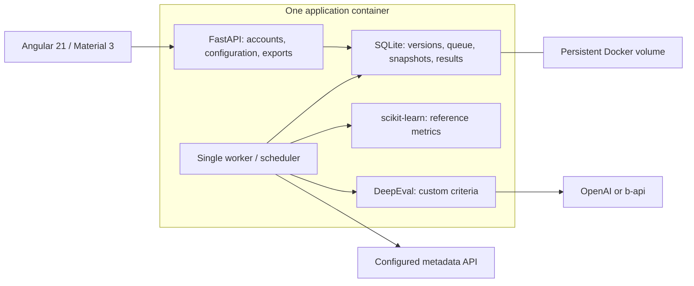

# Eval Expert implementation plan

Approved direction: internal team application, local accounts, Angular 21 with Material 3, reference benchmarks using scikit-learn, qualitative evaluations using DeepEval, OpenAI and b-api provider connections. No other evaluation framework is included.

## Deployment refinement

For the initial single-instance installation, ship one application image containing the compiled Angular frontend and FastAPI backend. A durable SQLite queue and an in-process background worker replace Celery, RabbitMQ and PostgreSQL from the initial architectural proposal. SQLite is stored on a named Docker volume, uses WAL, and is accessed through short transactions. This deliberately supports one application process and one instance; horizontal scaling requires a subsequent storage/worker migration.

Provide a root Dockerfile, docker-compose.yml, a separate Compose-from-URL configuration with a pinned Git build context, .env.example, and an environment initialization helper. Build and run the actual image before delivery. Hostinger deployment is documented for its VPS Docker Manager; no remote account deployment is part of this work.

## First delivery acceptance

1. Local authentication, administrative user creation, session revocation, CSRF and encrypted API credentials.
2. HTTP service configuration with an OpenAPI operation picker, explicit input mapping, response preview and output paths.
3. JSON/JSONL/CSV dataset import with separate inputs and reference annotations; an explicitly labeled demonstration dataset.
4. Editable field specifications, canonical label aliases, micro/macro P/R/F1, support, missing annotation coverage and technical success rate.
5. Custom criteria with versioned steps and thresholds; schema-aware DeepEval provider adapter for direct OpenAI and both b-api providers.
6. Queued reference/judge/combined runs, visible progress, cancellation, stored snapshots, restart recovery without replaying an uncertain external request.
7. Dashboard, reference and judge result views, per-case inspection, comparable history charts and simple schedules in Europe/Berlin.
8. CSV/JSON exports and a printable HTML report whose figures are derived from saved results.
9. Docker persistence, health checks, non-root runtime, sample environment, English operational README and CI checks.
10. Meaningful backend tests, real frontend build, browser end-to-end checks, mobile layout and local-asset checks.

## Deferred scope

Browser crawling and visual advertisement classification, a PDF rendering service, organization multitenancy, multiple evaluation engines, SSO, streaming or asynchronous target protocols, and automated calibration workflows remain subsequent deliveries. Text-based criteria can use source evidence supplied by a dataset or target; they cannot certify a website as advertising-free.

## Work packages

Each package starts with better-coding-workflow; UI packages also use better-coding-frontend and the approved Material 3 direction.

| Package | Modules | Verification |
| --- | --- | --- |
| A Reference core | domain, benchmarks, dataset parsing | Expected TP/FP/FN, empty labels, unknown predictions, missing annotations and failed calls |
| B Protected storage | config, database, auth, credentials, catalog | Session/CSRF lifecycle, role checks, secret redaction, immutable versions |
| C Execution | target, judge, runner, scheduler | Network policy, schema-aware judges, one target call, recovery, cancellation, deterministic schedule boundaries |
| D User interface | shell, setup pages, datasets, runs, reports | Build, real UI flows, failure states, keyboard labels and responsive screenshots |
| E Delivery | Dockerfile, Compose, environment helper, README, CI | Image build, container run, persistent volume restart and exported report |

Use external-network mocks for deterministic tests. Provider credentials and real user datasets are not available yet; demonstrate actual functionality with isolated sample inputs, and report live-provider integration as unverified until credentials are configured.
